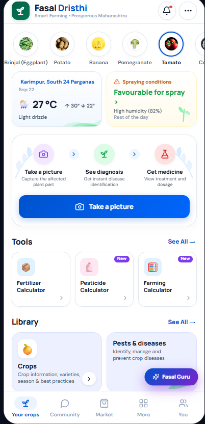
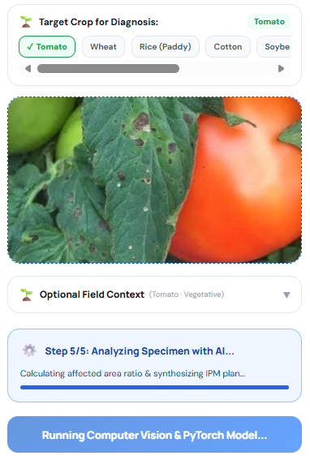
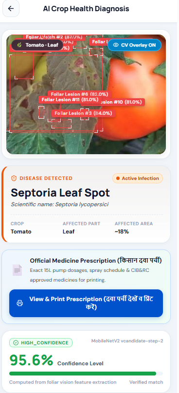

# 🌱 Fasal Dristhi (फसल दृष्टि)
### *Next-Gen AI Crop Health Diagnosis, Lesion Localization & Precision Advisory System*
**Smart India Hackathon (SIH 2026) Project**

[](https://opensource.org/licenses/MIT)
[](https://reactjs.org/)
[](https://nodejs.org/)
[](https://pytorch.org/)
[](https://ultralytics.com/)
[](https://fastapi.tiangolo.com/)
[](https://www.mongodb.com/)
[](#)

---

## 📱 App Preview & Visual Showcase

| 🌾 Farmer Dashboard & Agro-Weather | 🔬 AI Vision Scan Pipeline | 🩺 Disease Diagnosis & Prescription |
| :---: | :---: | :---: |
|  |  |  |
| *Real-time spray suitability, crop selector, quick action tools, and Fasal Guru assistant* | *Multi-step specimen validation, crop context selection, and PyTorch inference pipeline* | *YOLO foliar lesion detection overlay, calibrated confidence score, and Kisan Dawa Parchi* |

---

## 🧭 Workflow & Architecture Diagram

```mermaid
flowchart TD
    subgraph Farmer_Interface ["🌾 Farmer Client Layer (React 18 + Vite)"]
        A[📸 Farmer Captures / Uploads Leaf Specimen] --> B[🌱 Select Crop & Field Context]
        B --> C[🎨 Dual Theme Engine (Light / Dark Mode)]
        C --> D[📤 Submit Diagnosis Request]
    end

    subgraph Backend_Gateway ["🚀 API Gateway & Orchestration (Node.js / Express)"]
        D --> E{Cloudinary / Storage}
        E -->|Upload & URL| F[Express REST API Gateway]
        F -->|JSON Payload + Image Buffer| G[FastAPI Inference Service :8000]
        F --> H[(MongoDB Atlas DB)]
        H -->|Save Diagnosis History & User Records| F
    end

    subgraph ML_Pipeline ["🧠 Machine Learning & Computer Vision Microservice"]
        G --> I[Input Normalization & Resizing 224x224 / 640x640]
        I --> J[🔍 Multi-Angle Foliage Validation]
        
        J --> K[🧬 Disease Classification]
        K --> K1["MobileNetV2 / EfficientNet-B0"]
        K1 --> L["🌡️ Temperature Scaling Calibration (T ≈ 1.32)"]
        
        J --> M[🎯 Foliar Lesion Localization]
        M --> M1["YOLOv8 Bounding Box Detection"]
        M1 --> N["📊 Severity & Foliage Coverage Ratio (%)"]
        
        L & N --> O["📚 ICAR & CIB&RC Knowledge Engine"]
        O --> P["💊 Standardized Treatment Formulation & Pump Dosages"]
    end

    subgraph Decision_Support ["📋 Farmer Decision Support Output"]
        P --> Q[📄 JSON Diagnosis Response]
        Q --> R["🔲 Interactive CV Bounding Box Overlay"]
        Q --> S["🖨️ Kisan Dawa Parchi (Printable Prescription)"]
        Q --> T["📈 Follow-up Treatment & Recovery Tracker"]
        Q --> U["🛒 Agri-Marketplace Links (AgroStar / BigHaat)"]
    end

    G -.-> Q
    Q -.-> F
    F -.-> Farmer_Interface
```

---

## ⚡ Key Highlights & Core Capabilities

### 1. 🔬 Deep Vision AI Diagnosis & YOLO Lesion Localization
- **Multi-Class Disease Classification:** Uses deep convolutional networks (**MobileNetV2** and candidate **EfficientNet-B0**) trained and evaluated on extensive plant pathology datasets.
- **YOLOv8 Object Detection:** Draws interactive foliar lesion bounding boxes on affected leaf areas with individual spot confidence scores.
- **Platt Temperature Scaling:** Calibrates raw model logits using an empirical temperature parameter ($T$) to prevent overconfident false positives and deliver reliable diagnostic probabilities.
- **Foliar Severity Ratio:** Automatically computes estimated leaf infection coverage percentage (e.g. ~18% foliar necrosis).

### 2. 💊 Kisan Dawa Parchi (Official Printable Prescription)
- Prescribes government-compliant **ICAR & CIB&RC approved fungicides, bactericides, and bio-pesticides** (e.g., Chlorothalonil 75% WP, Difenoconazole 25% EC, Mancozeb, Trichoderma).
- Displays clear **per-liter** and **standard 15-liter knapsack pump dosages** tailored for Indian smallholder farmers.
- Lists mandatory **Pre-Harvest Intervals (PHI)** and PPE/safety protocols.
- Farmer can view and directly print the clean, black-and-white print-optimized prescription to take to local agro-dealers.

### 3. 🌤️ Agro-Meteorology & Spray Advisory
- Calculates real-time **favourable / unfavourable spray windows** based on temperature, relative humidity, wind speed, and rain forecasts.
- Protects farmers from chemical wash-off and environmental wastage.

### 4. 📈 Follow-Up Treatment Tracker & Timeline Comparison
- Farmers log initial symptoms (Day 0) and compare recovery photos at Day 3, Day 5, and Day 7 to monitor lesion healing.
- Ensures treatments are actively working and advises whether secondary intervention is required.

### 5. 🧮 Precision Agri-Calculators
- **Fertilizer Calculator:** Computes exact N-P-K requirements for Acre, Hectare, and Gunta field sizes.
- **Pesticide & Spray Calculator:** Calculates tank fills and chemical quantities without complex manual arithmetic.

### 6. 🌐 Multilingual Community & Integrated Agri-Market
- Supports Hindi (हिंदी), English, Marathi (मराठी), and Bengali (বাংলা) translations.
- Peer-to-peer farmer community feed with question translation and expert advice.
- Verified marketplace directing farmers to genuine input providers (AgroStar, BigHaat).

---

## 📂 Repository Structure

```text
Fasal_Dristhi/
├── backend/                       # Node.js & Express REST API
│   ├── models/                    # MongoDB Mongoose Schemas (User, Diagnosis, Community, etc.)
│   ├── routes/                    # API Endpoints (diagnosis, weather, market, community)
│   ├── services/                  # Cloudinary, weather service, and ML client
│   ├── index.js                   # Express application entrypoint
│   └── package.json
│
├── frontend/                      # React 18 + Vite Web Application
│   ├── src/
│   │   ├── components/            # UI Components (AuthScreen, BottomNav, TopHeader, etc.)
│   │   ├── diagnosis/             # AI Diagnosis, YOLO CV Overlay, Crop Protection & Prescription
│   │   ├── market/                # Marketplace Catalog, Filter Sheets, and Retailer Links
│   │   ├── main.jsx               # Application State & Screen Routing
│   │   ├── styles.css             # Core Glassmorphic Design System & Dark/Light Theme Tokens
│   │   └── index.css              # Typography and layout resets
│   ├── index.html
│   ├── vite.config.js
│   └── package.json
│
├── ml/                            # Python Computer Vision & ML Microservice
│   ├── models/                    # Trained PyTorch Weights & Temperature Calibration (.pth, .safetensors)
│   │   ├── plant_disease_model.pth
│   │   ├── plant_disease_candidate_efficientnet.pth
│   │   ├── class_indices.json
│   │   └── temperature_T.json
│   ├── scripts/                   # Dataset audit, YOLO pilot annotations, and validation scripts
│   ├── detection.py               # YOLOv8 Folair Lesion detector & bounding box generator
│   ├── model.py                   # PyTorch model definitions & temperature scaling
│   ├── knowledge_base.py          # ICAR & CIB&RC crop protection recommendations
│   ├── main.py                    # FastAPI application serving inference on :8000
│   └── requirements.txt           # Python dependencies (PyTorch, Torchvision, FastAPI, etc.)
│
├── docs/
│   └── screenshots/               # High-resolution screenshots of Fasal Dristhi UI
│       ├── home_dashboard.png
│       ├── diagnosis_scan.png
│       └── diagnosis_result.png
│
├── .env.example                   # Template for environment configuration
├── .gitignore                     # Git ignore rules for node_modules, venv, and large datasets
└── README.md                      # Project documentation and guide
```

---

## ⚙️ Installation & Local Setup

### 1. Prerequisites
- **Node.js** >= 18.x
- **Python** >= 3.10
- **Git**
- *(Optional)* **MongoDB** local instance or free MongoDB Atlas cluster URI.

---

### 2. Clone the Repository
```bash
git clone https://github.com/Anishgoswami-dev/Fasal_Dristhi.git
cd Fasal_Dristhi
```

---

### 3. Setup Python Machine Learning Service
```bash
cd ml

# Create and activate Python virtual environment
python -m venv venv

# On Windows:
venv\Scripts\activate
# On Linux/macOS:
# source venv/bin/activate

# Install required dependencies
pip install -r requirements.txt

# Run FastAPI inference server (Runs on port 8000)
python -m uvicorn main:app --host 127.0.0.1 --port 8000 --reload
```

---

### 4. Setup Backend API Gateway
Open a second terminal window:
```bash
cd backend

# Install node dependencies
npm install

# Configure environment variables
cp .env.example .env
# Edit .env with your MongoDB Atlas and Cloudinary credentials

# Start Express server (Runs on port 4000)
npm run dev
```

---

### 5. Setup Frontend Application
Open a third terminal window:
```bash
cd frontend

# Install dependencies
npm install

# Start Vite development server (Runs on port 5173)
npm run dev
```

Open your browser at `http://localhost:5173`.

---

## 🧪 Machine Learning Model Specifications

| Attribute | Specification |
| :--- | :--- |
| **Primary Architecture** | MobileNetV2 (Feature Extractor + Custom Foliar Head) |
| **Candidate Architecture** | EfficientNet-B0 (Compound Scaling with Swish Activation) |
| **Lesion Detector** | YOLOv8 nano / small (Localized foliar lesion bounding boxes) |
| **Logit Calibration** | Platt Temperature Scaling ($T \in [1.2, 1.4]$) |
| **Input Dimensions** | $224 \times 224 \times 3$ (Classification), $640 \times 640$ (YOLO Detection) |
| **Target Crops** | Tomato, Brinjal, Potato, Rice (Paddy), Wheat, Cotton, Soybean, Chilli, etc. |
| **Knowledge Standards** | ICAR (Indian Council of Agricultural Research) & CIB&RC Guidelines |

---

## 👥 Smart India Hackathon (SIH 2026) Team
- **Project Name:** Fasal Dristhi (फसल दृष्टि)
- **Repository:** [https://github.com/Anishgoswami-dev/Fasal_Dristhi](https://github.com/Anishgoswami-dev/Fasal_Dristhi)
- **Developer & Lead:** Anish Goswami ([@Anishgoswami-dev](https://github.com/Anishgoswami-dev))
- **Email:** `anishgoswami20006@gmail.com`

---

## 📄 License
This project is licensed under the [MIT License](LICENSE).
