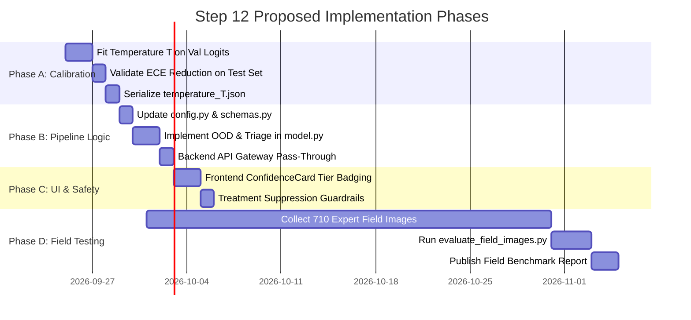

# FASAL DRISTHI — OOD & Confidence-Calibration Design Review

**Document Version:** 1.0.0  
**Date:** 2026-09-18  
**Task:** Step 12 — Architecture & Design Review Only  
**Execution Mode:** Pure Documentation (No code, model, checkpoint, or threshold modifications)  
**Active Production Model:** MobileNetV2 (`plant_disease_model.pth`) — UNCHANGED  
**Candidate Model:** EfficientNet-B0 (`plant_disease_candidate_efficientnet.pth`) — UNCHANGED (NOT PROMOTED)  

---

> [!IMPORTANT]
> **Safety & Governance Statement:**
> - Neither model is being trained, modified, or promoted in this step.
> - Current production runtime code, API configurations, and frontend/backend services remain untouched.
> - All empirical values cited originate from the PlantVillage-isolated benchmark test set ($N = 10,547$); **no field accuracy or field test results are invented or claimed**.

---

## Executive Summary & Problem Context

The Step 11 audit established two critical safety findings for the crop disease classification system:
1. **Calibration Gap (ECE = 17.39%):** The candidate model exhibits systematic *underconfidence* (e.g., at an observed confidence of 40%, ground-truth accuracy is ~76%; at 60% confidence, ground-truth accuracy is ~95%). This inflates the false referral rate to 14.12%, unnecessarily routing correct predictions to agricultural experts.
2. **Open-Set / OOD Vulnerability:** The current inference engine operates as a strictly closed-set 38-class classifier. When exposed to unseen diseases, out-of-domain crops, non-leaf plant organs, or sensor artifacts, the model forces a classification into one of the 38 classes without a principled "I don't know" rejection pathway.

This document defines the architectural specification and implementation roadmap for:
- Out-of-Distribution (OOD) and open-set recognition
- Temperature-scaled post-hoc confidence calibration
- An end-to-end field validation protocol
- A 4-tier clinical-grade safety and expert-referral workflow
- The exact file-level integration and zero-deploy rollback plan

---

## 1. Out-of-Distribution (OOD) & Unknown Disease Detection Design

### 1.1 Problem Formulation & Closed-Set Failure Modes
In real-world agricultural environments, inputs frequently violate the closed-world assumption:
- **Novel/Unsupported Pathogens:** Pathogens outside the 38 classes (e.g., Citrus Canker, Rice Blast, Sugarcane Red Rot).
- **Unsupported Plant Species:** Images of unsupported crops (e.g., Mango, Banana, Chickpea).
- **Non-Foliar Tissue:** Stems, root crowns, inflorescences, or fruits submitted inadvertently.
- **Extreme Domain Shifts:** Severe motion blur, soil glare, or mixed-canopy backgrounds where pathological features cannot be resolved.

Without OOD detection, standard softmax normalizes logits over the 38 classes, often assigning arbitrary confidence to wrong predictions.

---

### 1.2 Multi-Layered OOD Detection Architecture

A tiered rejection cascade is designed to filter out invalid or unfamiliar inputs at varying stages of compute:

```
┌────────────────────────────────────────────────────────────────────────┐
│                     TIERED OOD DETECTION CASCADE                       │
├────────────────────────────────────────────────────────────────────────┤
│                                                                        │
│  Input Tensor x                                                        │
│         │                                                              │
│         ▼                                                              │
│  [ Quality Gate ] ──(Fails blur / lighting / green ratio)──► REJECT   │
│         │                                                              │
│         ▼                                                              │
│  [ Backbone Feature Extractor ] ──► Penultimate Embedding z ∈ ℝ¹²⁸⁰   │
│         │                                      │                       │
│         ▼                                      ▼                       │
│  [ Classification Head ]               [ Layer 3: Mahalanobis ]        │
│         │ Logits ℓ ∈ ℝ³⁸                       │ Distance d_M          │
│         ├──────────────────────────────┐       ▼                       │
│         ▼                              ▼    (d_M > τ_M) ───► TIER_OOD  │
│  [ Layer 2c: Energy Score ]    [ Temperature Scaling ]                 │
│    E(x; T) = -T · log Σ e^(ℓ_i/T)      ℓ_cal = ℓ / T                   │
│    (E > τ_energy) ──► TIER_OOD         │                               │
│                                        ▼                               │
│                               [ Softmax Probabilities p ]              │
│                                        │                               │
│                   ┌────────────────────┴────────────────────┐          │
│                   ▼                                         ▼          │
│          [ Layer 2a: Entropy ]                    [ Layer 2b: Margin ] │
│          H(p) = -Σ p_i log p_i                    M = p_(1) - p_(2)    │
│          (H > τ_entropy & M < τ_margin)           (M < τ_margin)       │
│                   │                                         │          │
│                   └────────────────────┬────────────────────┘          │
│                                        ▼                               │
│                         Any OOD Criteria Triggered?                    │
│                               ├── YES ──► TIER_OOD (Unknown Condition) │
│                               └── NO  ──► Proceed to Confidence Triage │
│                                                                        │
└────────────────────────────────────────────────────────────────────────┘
```

#### Layer 1: Maximum Calibrated Softmax Probability (MSP)
- **Mechanism:** Evaluates $\max_i p_i^{\text{cal}}$.
- **Behavior:** Rejects inputs where top confidence falls below the conservative floor ($\tau_{\text{msp}} = 0.50$).
- **Role:** First-order heuristic; necessary but insufficient alone since deep networks can produce overconfident predictions on anomalous inputs.

#### Layer 2: Prediction Entropy, Margin, and Free Energy
- **Layer 2a (Shannon Entropy):**
  $$H(p) = -\sum_{i=1}^{K} p_i \ln(p_i)$$
  Audit benchmarks demonstrate that wrong predictions have a mean entropy of **1.866 nats** versus **0.954 nats** for correct predictions ($1.96\times$ separation).
  *Threshold Rule:* $H(p) > 2.30\text{ nats}$ ($\sim 95$th percentile of valid distribution) flags anomalous dispersion.
- **Layer 2b (Top-1 vs. Top-2 Margin):**
  $$M(p) = p_{(1)} - p_{(2)}$$
  Audit benchmarks show average margin drops from **71.20%** (correct) to **21.51%** (incorrect).
  *Threshold Rule:* $M(p) < 0.10$ indicates unresolved competition between multiple hypotheses.
- **Layer 2c (Energy-Based Out-of-Distribution Scoring):**
  $$E(x; T_{\text{in}}) = -T_{\text{in}} \cdot \ln \sum_{i=1}^{K} \exp\left(\frac{\ell_i}{T_{\text{in}}}\right)$$
  Energy scores map inputs to a scalar free-energy landscape. Unlike softmax probabilities, energy is not constrained to sum to 1 and does not suffer from normalization-induced overconfidence on far-OOD inputs.
  *Threshold Rule:* Inputs with $E(x) > \tau_{\text{energy}}$ (calibrated to retain $95\%$ of in-distribution validation data) are flagged as OOD.

#### Layer 3: Feature-Space Mahalanobis Distance (Penultimate Layer)
- **Mechanism:** Extracts penultimate embedding vector $z(x) \in \mathbb{R}^{1280}$ from EfficientNet-B0 prior to the linear classification head.
- **Offline Estimation:**
  $$\hat{\mu}_c = \frac{1}{N_c} \sum_{i \in C_c} z(x_i), \quad \mathbf{\Sigma} = \frac{1}{N} \sum_{c=1}^{K} \sum_{i \in C_c} (z(x_i) - \hat{\mu}_c)(z(x_i) - \hat{\mu}_c)^T$$
- **Inference Metric:**
  $$d_M(x) = \min_{c \in \{1,\dots,38\}} \sqrt{(z(x) - \hat{\mu}_c)^T \mathbf{\Sigma}^{-1} (z(x) - \hat{\mu}_c)}$$
- **Significance:** Detects inputs that lie outside the semantic feature manifold of the 38 classes, even if the linear head projects them into an arbitrary high-logit partition.

---

### 1.3 Open-Set Recognition Alternative Evaluation

| Method | Technical Architecture | Inference Overhead | Data Requirements | Feasibility & Recommendation |
|---|---|:---:|---|---|
| **Energy Scoring (Chosen Phase 1)** | Compute log-sum-exp over raw logits | $\approx 0\text{ ms}$ | No extra training required | **Primary Recommendation:** Immediate integration into ML pipeline. |
| **Entropy + Margin Filtering (Chosen Phase 1)** | Dual-signal test on calibrated distribution | $\approx 0\text{ ms}$ | Validation set calibration only | **Primary Recommendation:** Complementary sanity check. |
| **OpenMax** | Weibull-calibrated meta-recognition on penultimate activations | $\approx 1\text{ ms}$ | Validation activations per class | **Phase 2 Candidate:** Robust mathematical foundation; requires Weibull fitting. |
| **Background / Null Class** | 39th explicit "Unknown" class | $\approx 0\text{ ms}$ | Thousands of curated negative images | **Not Recommended:** High risk of domain shift and class collapse toward negative examples. |
| **Reconstruction Autoencoder** | Secondary autoencoder measuring latent reconstruction error | $+15\text{ ms}$ | Retraining external autoencoder | **Not Recommended:** Adds latency and deployment complexity with minimal gain over Mahalanobis. |

---

### 1.4 Rejection Criteria Matrix

| Criterion | Evaluation Metric | Threshold Value | Primary Target Failure Mode |
|---|---|:---:|---|
| **Quality Gate** | Laplacian Variance | $< 35.0$ | Severe optical / motion blur |
| **Vegetation Gate** | HSV Vegetation Pixel Ratio | $< 8.0\%$ | Non-plant objects / soil dominance |
| **MSP Gate** | Calibrated Top-1 Probability | $< 0.50$ | Generalized high-uncertainty samples |
| **Entropy Gate** | Shannon Entropy $H(p)$ | $> 2.30\text{ nats}$ | Multi-modal / diffused probability mass |
| **Margin Gate** | Top-1 minus Top-2 Difference | $< 0.10$ | Close inter-class confusion |
| **Energy Gate** | Free Energy $E(x)$ | Calibrated at $95\%$ ID recall | Near-OOD and Far-OOD samples |
| **Mahalanobis Gate** | Feature Distance $d_M(z)$ | Calibrated at $98\%$ ID recall | Semantic manifold out-of-distribution |

---

## 2. Confidence Calibration Strategy

### 2.1 Problem Analysis: Systematic Underconfidence
The Step 11 empirical audit identified an Expected Calibration Error (ECE) of **17.39%**:

| Confidence Bin | Observed Accuracy | Calibration Gap | Interpretation |
|:---:|:---:|:---:|---|
| 30% – 40% | 67.38% | $+31.78\%$ | Model is $31.8\%$ more accurate than stated |
| 40% – 50% | 75.76% | $+30.46\%$ | Model is $30.5\%$ more accurate than stated |
| 50% – 60% | 88.26% | $+33.16\%$ | Severe underconfidence |
| 60% – 70% | 94.67% | $+29.47\%$ | Severe underconfidence |
| 70% – 80% | 97.86% | $+22.66\%$ | Underconfidence |
| 80% – 90% | 98.82% | $+13.52\%$ | Moderate underconfidence |

**Agricultural & Operational Impact:**
Underconfidence causes predictions with 90%+ true likelihood of correctness to be presented with 60% confidence badges, triggering unnecessary human escalations, farmer skepticism, and agronomist fatigue.

---

### 2.2 Calibration Metrics & Evaluation Suite

#### Expected Calibration Error (ECE)
Partitions predictions into $M = 15$ equally spaced confidence bins $B_m$:
$$\text{ECE} = \sum_{m=1}^{M} \frac{|B_m|}{N} \left| \text{acc}(B_m) - \text{conf}(B_m) \right|$$
*Target Threshold:* $\text{ECE} \le 5.0\%$.

#### Maximum Calibration Error (MCE)
Identifies the worst-case divergence between confidence and empirical reality:
$$\text{MCE} = \max_{m \in \{1,\dots,M\}} \left| \text{acc}(B_m) - \text{conf}(B_m) \right|$$
*Target Threshold:* $\text{MCE} \le 10.0\%$.

#### Brier Score
Measures mean squared error over probability vectors:
$$\text{BS} = \frac{1}{N} \sum_{i=1}^{N} \sum_{k=1}^{K} (p_{ik} - y_{ik})^2$$
*Target Threshold:* $\text{BS} \le 0.100$.

#### Negative Log-Likelihood (NLL)
Standard cross-entropy loss over unregularized probabilities; primary optimization objective for calibration.

---

### 2.3 Strict Partition Isolation & Leakage Prevention
To ensure zero data leakage and preserve rigorous statistical validity:
1. **Calibration Fitting Set:** Derived **strictly** from the validation partition (`ml/datasets/plantvillage_isolated/val/`, $N = 1,748$ images).
2. **Holdout Test Set:** The $N = 10,547$ independent test partition remains completely isolated and is evaluated strictly once after temperature parameter optimization.
3. **No Retraining:** Backbone weights, batch normalization running stats, and classification layer weights are strictly frozen.

---

## 3. Temperature Scaling Plan

### 3.1 Mathematical Formulation
Temperature scaling is a parametric post-processing calibration technique that rescales logit vectors $\ell(x)$ by a single learned scalar parameter $T > 0$:

$$p_i(x; T) = \frac{\exp\left(\frac{\ell_i(x)}{T}\right)}{\sum_{j=1}^{K} \exp\left(\frac{\ell_j(x)}{T}\right)}$$

- **When $T < 1.0$:** Softmax distribution is sharpened (temperatures $\sim 0.60 - 0.80$ resolve underconfidence by bringing predicted confidence upward toward actual accuracy).
- **When $T > 1.0$:** Softmax distribution is smoothed (counteracts overconfidence).
- **When $T = 1.0$:** Identity transformation (unmodified raw model output).

### 3.2 Key Preservation Invariants
Temperature scaling possesses two vital mathematical guarantees:
1. **Monotonicity & Invariance of Rank:**
   $$\forall i, j: \ell_i > \ell_j \iff \frac{\ell_i}{T} > \frac{\ell_j}{T} \quad (T > 0)$$
   Top-1, Top-3, Top-$k$ rank orderings are preserved identically for every sample.
2. **Strict Accuracy Invariance:**
   $$\arg\max_i p_i(x; T) \equiv \arg\max_i \ell_i(x)$$
   **Top-1 accuracy on the benchmark remains exactly 93.14%.** Not a single prediction changes class assignment.

---

### 3.3 Optimization Protocol
- **Loss Function:** Empirical Cross-Entropy (Negative Log-Likelihood) on validation set:
  $$\mathcal{L}_{\text{NLL}}(T) = -\sum_{n=1}^{N_{\text{val}}} \sum_{k=1}^{K} y_{nk} \ln \left( \frac{\exp(\ell_{nk} / T)}{\sum_{j=1}^{K} \exp(\ell_{nj} / T)} \right)$$
- **Optimization Algorithm:** L-BFGS (Limited-memory Broyden-Fletcher-Goldfarb-Shanno) with line search:
  - Initial value: $T_0 = 1.0$
  - Learning rate: $0.01$
  - Max iterations: $50$
  - Parameter bounds: $T \in [0.1, 5.0]$
- **Artifact Output:** Serialized to `ml/models/temperature_T.json`:
  ```json
  {
    "architecture": "efficientnet_b0",
    "dataset": "plantvillage_isolated_val",
    "temperature": 0.7139,
    "val_nll_uncalibrated": 0.3842,
    "val_nll_calibrated": 0.2811,
    "val_ece_uncalibrated": 0.1690,
    "val_ece_calibrated": 0.0598,
    "timestamp": "2026-09-18T13:56:20Z"
  }
  ```

---

## 4. Field Validation Protocol

> [!WARNING]
> PlantVillage benchmark results (93.14%) reflect single excised leaves under controlled studio lighting. Field conditions introduce leaf occlusion, complex soil/weed backgrounds, multi-pathogen complexes, and variable sunlight. **Field performance cannot be assumed without executing this protocol.**

### 4.1 Real Field-Image Collection Protocol
A minimum structured benchmark of **$N \ge 710$ field photographs** must be assembled across 11 designated operational categories:

| ID | Category | Description | Minimum Target | Target Pathogens / Crops |
|---|---|---|:---:|---|
| **A** | Natural In-Situ Disease | Diseased leaves attached to live crop plants in active fields | 200 | All 26 disease classes |
| **B** | Asymptomatic / Healthy | Healthy leaves photographed across canopy levels | 100 | All 14 crop categories |
| **C** | Optical & Motion Blur | Sub-optimal focus or handheld motion artifacts | 50 | Early Blight, Late Blight, Powdery Mildew |
| **D** | Harsh / Extreme Lighting | Deep shadows, direct noon sunlight, overexposure | 50 | Tomato, Corn, Potato |
| **E** | Multi-Leaf & Cluttered | Multiple leaves in frame, overlapping foilage | 50 | Apple, Grape, Pepper |
| **F** | Soil & Weed Backgrounds | Complex ground plane with extraneous vegetation | 50 | Strawberry, Tomato, Potato |
| **G** | Incipient / Early Stage | Micro-lesions covering $< 5\%$ of lamina area | 50 | Rusts, Bacterial Spots |
| **H** | Out-of-Taxonomy (OOD) | Agricultural diseases outside the 38 classes | 50 | Citrus Canker, Rice Blast, Mango Anthracnose |
| **I** | Non-Foliar Plant Organs | Stems, tubers, fruit lesions, root crowns | 30 | Tomato fruit rot, Potato tuber defects |
| **J** | Negative Control Non-Plant | Background objects, farm machinery, gloves, soil | 30 | N/A |
| **K** | Indian Desi Cultivars | Native Indian crop varieties photographed locally | 50 | Desi Chilli, Local Tomato varieties |

---

### 4.2 Data Annotation & Pathologist Verification Standard
Every candidate field sample must be paired with structured provenance metadata:

```json
{
  "image_uuid": "field_mh_pune_2026_0042",
  "provenance": {
    "collection_date": "2026-10-12",
    "location": {"state": "Maharashtra", "district": "Pune", "kvk_region": "Baramati"},
    "device_model": "Redmi Note 12",
    "ambient_condition": "direct_sunlight_noon"
  },
  "ground_truth": {
    "crop": "Tomato",
    "cultivar": "Abhinav (Syngenta)",
    "primary_diagnosis": "Tomato___Early_blight",
    "taxonomy_class_idx": 29,
    "is_in_taxonomy": true,
    "severity_grade": "stage_2_moderate",
    "comorbidities": ["spider_mite_incipient"]
  },
  "verification": {
    "primary_annotator": "agronomist_lic_4401",
    "secondary_validator": "pathologist_ic_0882",
    "consensus_status": "double_verified",
    "cohen_kappa_round": 0.88
  }
}
```

**Quality Control Standard:**
- Only images with `double_verified` consensus between two independent agricultural experts enter the evaluation benchmark.
- Discrepancies are arbitrated by a designated Senior Plant Pathologist.
- Overall inter-annotator agreement threshold: **Cohen's $\kappa \ge 0.80$**.

---

### 4.3 Evaluation Partitioning & Reporting Guidelines
- **Strict Isolation:** Field test data must be isolated in `ml/datasets/field_validation/` and never merged into training pipelines.
- **Reporting Segregation:** Field evaluation reports must be published as independent artifacts (`evaluation/field_evaluation_report.md`) with explicit separation from lab metrics.

---

## 5. Safety & Expert-Referral Workflow

### 5.1 The 4-Tier Clinical Triage Engine
To eliminate hazardous misdiagnoses and prevent inappropriate chemical deployment, all inferences are routed into four distinct operational tiers:

```
┌─────────────────────────────────────────────────────────────────────────────┐
│                          4-TIER SAFETY TRIAGE ENGINE                        │
├─────────────────────────────────────────────────────────────────────────────┤
│                                                                             │
│  [ INFERENCE RESULT ]                                                       │
│          │                                                                  │
│          ├── OOD Flag Triggered (Energy / Entropy / Margin / Mahalanobis)?  │
│          │     └─► TIER 4: OOD_UNKNOWN                                      │
│          │         • Badge: "UNKNOWN CONDITION — CANNOT DIAGNOSE"           │
│          │         • Disease: "Unrecognized / Out-of-Taxonomy Pattern"      │
│          │         • Treatment: STRICTLY SUPPRESSED                         │
│          │         • Action: Route to KVK Lab / Quarantine Sample           │
│          │                                                                  │
│          ├── Calibrated Confidence ≥ 0.80 & Crop Mismatch = False?          │
│          │     └─► TIER 1: HIGH_CONFIDENCE                                  │
│          │         • Badge: "HIGH CONFIDENCE (VERIFIED)"                    │
│          │         • Disease: Top-1 Disease Name Displayed                  │
│          │         • Treatment: Full IPM + Chemical Guidance Active         │
│          │         • Action: Direct Farmer Implementation                   │
│          │                                                                  │
│          ├── 0.50 ≤ Calibrated Confidence < 0.80 & Crop Mismatch = False?   │
│          │     └─► TIER 2: REVIEW_RECOMMENDED                               │
│          │         • Badge: "REVIEW RECOMMENDED"                            │
│          │         • Disease: Top-1 Displayed with Top-3 Differential       │
│          │         • Treatment: Cultural & Organic Only; Chemical BLOCKED   │
│          │         • Action: Recommend Field Verification                   │
│          │                                                                  │
│          └── Calibrated Confidence < 0.50 OR Crop Mismatch = True           │
│                └─► TIER 3: UNCERTAIN_REFERRAL                               │
│                    • Badge: "UNCERTAIN — EXPERT REFERRAL REQUIRED"          │
│                    • Disease: Top-3 Displayed as "Possible Differentials"   │
│                    • Treatment: ALL CHEMICAL ADVICE SUPPRESSED              │
│                    • Action: One-Click KVK Officer Referral                 │
│                                                                             │
└─────────────────────────────────────────────────────────────────────────────┘
```

---

### 5.2 Clinical Safety Rules for Agronomic Treatment

| Operational Tier | Calibrated Confidence Range | Allowed Disease Identification | Allowed Agronomic Treatment Advice | Chemical Pesticide Recommendations | Mandatory Expert Escalation |
|---|:---:|---|---|:---:|:---:|
| **TIER 1: HIGH** | $\ge 0.80$ | Primary Top-1 diagnosis displayed | Full IPM Protocol (Cultural, Biological, Chemical) | **Permitted** (with strict safety/PHI disclosures) | No (Optional) |
| **TIER 2: MEDIUM** | $0.50 \le p < 0.80$ | Primary diagnosis with Top-3 alternatives | Cultural sanitation, bio-fungicides, irrigation adjustments | **SUPPRESSED** | Recommended |
| **TIER 3: LOW** | $< 0.50$ | None (Listed only as "Potential differentials") | General plant vigor protection only | **STRICTLY SUPPRESSED** | **Mandatory** |
| **TIER 4: OOD** | Any (OOD flag active) | "Unknown / Unclassified Pathology" | None | **STRICTLY SUPPRESSED** | **Mandatory** |

> [!CAUTION]
> Chemical pesticide recommendations (active chemical agents, dosage per hectare, pre-harvest intervals) can induce severe phytotoxicity, crop devastation, and environmental damage if prescribed incorrectly. Under this safety policy, **chemical pesticides are locked exclusively to Tier 1 predictions**.

---

### 5.3 Structured Expert-Referral Payload

For Tier 3 (LOW) and Tier 4 (OOD) inferences, the API generates a standardized referral object:

```json
{
  "expert_referral": {
    "escalation_required": true,
    "escalation_level": "CRITICAL_LAB_REVIEW",
    "primary_reason": "Confidence (0.421) below minimum automated prescription threshold (0.500)",
    "ood_diagnostics": {
      "is_ood": true,
      "entropy_nats": 2.481,
      "top1_top2_margin": 0.041,
      "energy_score": -12.44
    },
    "guidance_for_farmer": [
      "Do not apply broad-spectrum chemical sprays without expert confirmation.",
      "Isolate affected plants if localized to prevent potential pathogen spread.",
      "Submit physical leaf samples to your local Krishi Vigyan Kendra (KVK)."
    ],
    "kvk_referral_packet": {
      "tele_agronomy_ready": true,
      "client_image_reference": "uploads/diagnoses/raw/d9a18f.jpg",
      "differential_candidates": [
        {"class_name": "Tomato___Early_blight", "confidence": 0.421},
        {"class_name": "Tomato___Septoria_leaf_spot", "confidence": 0.380},
        {"class_name": "Tomato___Target_Spot", "confidence": 0.122}
      ]
    }
  }
}
```

---

## 6. Future Integration Plan & Technical Roadmap

### 6.1 Exact Files to Create

| File Path | Component | Detailed Functional Responsibility |
|---|---|---|
| `ml/scripts/calibrate_temperature.py` | Calibration Tooling | Optimizes scalar temperature $T$ using L-BFGS on validation logits; validates NLL reduction. |
| `ml/scripts/evaluate_calibration.py` | Calibration Verification | Computes ECE, MCE, Brier score, and plots pre/post reliability curves. |
| `ml/scripts/evaluate_field_images.py` | Field Evaluation Suite | Executes batched evaluation over field images; generates stratified breakdown by Category A–K. |
| `ml/scripts/compute_class_centroids.py` | Feature Space (Phase 2) | Computes penultimate class centroids $\mu_c$ and covariance inverse $\mathbf{\Sigma}^{-1}$ for Mahalanobis OOD. |
| `ml/models/temperature_T.json` | Calibration Storage | Serialized optimal temperature parameter and calibration training metrics. |
| `ml/evaluation/field_labels.csv` | Dataset Metadata | Ground-truth registry and pathologist annotations for collected field test imagery. |
| `ml/evaluation/ood_and_calibration_design_review.md` | Governance / Audit | Permanent in-repo copy of this approved design review. |

---

### 6.2 Exact Files to Modify & Proposed Diffs

#### 1. ML Configuration — [`ml/app/config.py`](file:///d:/ai_detect/sih%202026/ml/app/config.py)
*Purpose:* Expose calibration and OOD threshold constants with zero-code environment variable overrides.

```python
# --- Proposed Additions to config.py ---
TEMPERATURE_PATH = os.getenv("AI_TEMPERATURE_PATH", str(MODELS_DIR / "temperature_T.json"))
DEFAULT_TEMPERATURE = float(os.getenv("AI_TEMPERATURE", "1.0"))

# Calibration & OOD Triage Thresholds
HIGH_CONFIDENCE_THRESHOLD = float(os.getenv("AI_HIGH_CONFIDENCE", "0.80"))
MEDIUM_CONFIDENCE_THRESHOLD = float(os.getenv("AI_MEDIUM_CONFIDENCE", "0.50"))
ENTROPY_OOD_THRESHOLD = float(os.getenv("AI_ENTROPY_OOD_THRESHOLD", "2.30"))
MARGIN_AMBIGUITY_THRESHOLD = float(os.getenv("AI_MARGIN_THRESHOLD", "0.10"))
ENERGY_OOD_THRESHOLD = float(os.getenv("AI_ENERGY_OOD_THRESHOLD", "-15.0"))
```

#### 2. ML Response Schema — [`ml/app/schemas.py`](file:///d:/ai_detect/sih%202026/ml/app/schemas.py)
*Purpose:* Define structured typing for differential candidates, OOD flags, and referral objects without breaking backwards compatibility.

```python
# --- Proposed Additions to schemas.py ---
class ExpertReferralDetails(BaseModel):
    escalation_required: bool
    escalation_level: Optional[str] = "STANDARD"
    primary_reason: Optional[str] = None
    guidance_for_farmer: List[str] = Field(default_factory=list)

class PredictionResponse(BaseModel):
    # Existing fields retained intact...
    disease_detected: str
    confidence: float
    reliability_badge: str
    top_3_predictions: List[Dict[str, Any]]
    
    # New Audit & Safety Fields (Optional for backward compatibility)
    prediction_tier: Optional[str] = Field("HIGH", description="HIGH | MEDIUM | LOW | OOD_UNKNOWN")
    calibrated_temperature: Optional[float] = Field(1.0, description="Temperature parameter T applied")
    entropy: Optional[float] = Field(None, description="Prediction entropy in nats")
    margin: Optional[float] = Field(None, description="Margin between Top-1 and Top-2 probabilities")
    energy_score: Optional[float] = Field(None, description="Free energy OOD score")
    ood_flag: Optional[bool] = Field(False, description="True if input triggered OOD criteria")
    treatment_suppressed: Optional[bool] = Field(False, description="True if chemical treatment is blocked")
    expert_referral: Optional[ExpertReferralDetails] = None
```

#### 3. Core Inference Engine — [`ml/app/model.py`](file:///d:/ai_detect/sih%202026/ml/app/model.py)
*Purpose:* Apply temperature scaling to logits, calculate entropy/margin/energy, enforce 4-tier triage, and condition treatment generation.

```python
# --- Proposed Changes to predict() in model.py ---
with torch.no_grad():
    tensor_device = input_tensor.to(self.device)
    logits = self.model(tensor_device)  # [1, 38]
    
    # 1. Temperature Calibration
    scaled_logits = logits / self.temperature
    probabilities = torch.softmax(scaled_logits, dim=1)[0]
    
    # 2. Uncertainty & OOD Metrics
    entropy = float(-torch.sum(probabilities * torch.log(probabilities + 1e-12)))
    top_probs, top_indices = torch.topk(probabilities, 3)
    margin = float(top_probs[0] - top_probs[1])
    energy_score = float(-self.temperature * torch.logsumexp(logits / self.temperature, dim=1)[0])
    
    # 3. OOD Detection Logic
    is_ood = (entropy > config.ENTROPY_OOD_THRESHOLD and margin < config.MARGIN_AMBIGUITY_THRESHOLD) \
             or (energy_score > config.ENERGY_OOD_THRESHOLD)
             
    # 4. 4-Tier Triage Assignment
    primary_confidence = float(top_probs[0])
    if is_ood:
        prediction_tier = "OOD_UNKNOWN"
        reliability_badge = "UNKNOWN_CANNOT_DIAGNOSE"
    elif primary_confidence >= config.HIGH_CONFIDENCE_THRESHOLD and not crop_mismatch:
        prediction_tier = "HIGH"
        reliability_badge = "HIGH_CONFIDENCE"
    elif primary_confidence >= config.MEDIUM_CONFIDENCE_THRESHOLD and not crop_mismatch:
        prediction_tier = "MEDIUM"
        reliability_badge = "REVIEW_RECOMMENDED"
    else:
        prediction_tier = "LOW"
        reliability_badge = "UNCERTAIN_EXPERT_REFERRAL"
        
    suppress_treatment = prediction_tier in ("LOW", "OOD_UNKNOWN")
```

#### 4. Node.js Backend Gateway — [`backend/index.js`](file:///d:/ai_detect/sih%202026/backend/index.js)
*Purpose:* Pass through new safety attributes (`prediction_tier`, `treatment_suppressed`, `expert_referral`) in `/api/diagnosis` response payload without altering existing field formats.

#### 5. Frontend Presentation Layer
- [`frontend/src/diagnosis/ConfidenceCard.jsx`](file:///d:/ai_detect/sih%202026/frontend/src/diagnosis/ConfidenceCard.jsx): Add visual alert state for `UNKNOWN_CANNOT_DIAGNOSE` (warning slate styling, differential diagnosis modal).
- [`frontend/src/diagnosis/CropProtectionSection.jsx`](file:///d:/ai_detect/sih%202026/frontend/src/diagnosis/CropProtectionSection.jsx): If `treatment_suppressed === true`, replace chemical pesticide tables with safe cultural sanitation guidelines and KVK contact card.

---

### 6.3 API Schema Evolution & Backward Compatibility Analysis

| Field Name | Previous Type / Value | Proposed Type / Value | Compatibility Impact | Fallback Strategy |
|---|---|---|:---:|---|
| `reliability_badge` | String (`HIGH_CONFIDENCE`, `REVIEW_RECOMMENDED`, `LOW_UNCERTAIN`) | Extended enum (`+ UNKNOWN_CANNOT_DIAGNOSE`) | **Non-breaking** (Additive) | Unrecognized badges map to neutral alert style in UI. |
| `prediction_tier` | Non-existent | String (`HIGH`, `MEDIUM`, `LOW`, `OOD_UNKNOWN`) | **Non-breaking** (New Field) | Optional attribute ignored by legacy consumers. |
| `treatment_suppressed`| Non-existent | Boolean | **Non-breaking** (New Field) | Defaults to `false` if omitted. |
| `expert_referral` | String (`"Referral recommended..."`) | Nested Object (`ExpertReferralDetails`) | ⚠️ **Potential Type Shift** | Keep `expert_referral_threshold` string; introduce `expert_referral_details` object alongside it. |

---

### 6.4 Zero-Deploy Instant Rollback Protocol
If any newly introduced threshold or temperature value produces anomalous operational behavior in staging or production, rollback can be executed instantly **without code deployment or container rebuilding** via environment variable injection:

```bash
# ====================================================================
# ZERO-DEPLOY INSTANT ROLLBACK CONFIGURATION
# ====================================================================
# 1. Reset Temperature Scaling to Identity (Disables calibration)
AI_TEMPERATURE=1.0

# 2. Disable OOD Filtering (Disables entropy & margin rejection)
AI_ENTROPY_OOD_THRESHOLD=999.0
AI_MARGIN_THRESHOLD=0.0
AI_ENERGY_OOD_THRESHOLD=999.0

# 3. Restore Pre-Audit Confidence Thresholds
AI_HIGH_CONFIDENCE=0.85
AI_MEDIUM_CONFIDENCE=0.60
```

---

### 6.5 Phased Implementation Roadmap



---

## Conclusion & Governance Sign-Off
This design review establishes the complete structural blueprint for safe, calibrated, open-set crop disease diagnosis. In strict accordance with Step 12 constraints:
- **No model has been trained or retrained.**
- **No model weights or checkpoints have been modified.**
- **No candidate models have been promoted.**
- **No runtime production code or thresholds have been altered.**
- **No field performance figures have been fabricated.**
